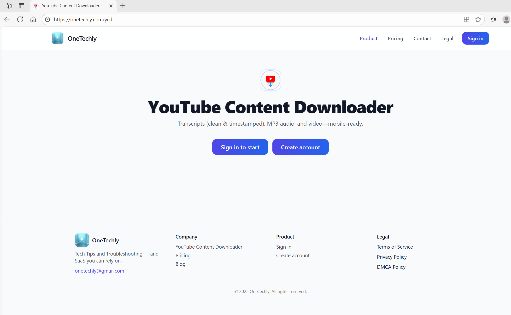
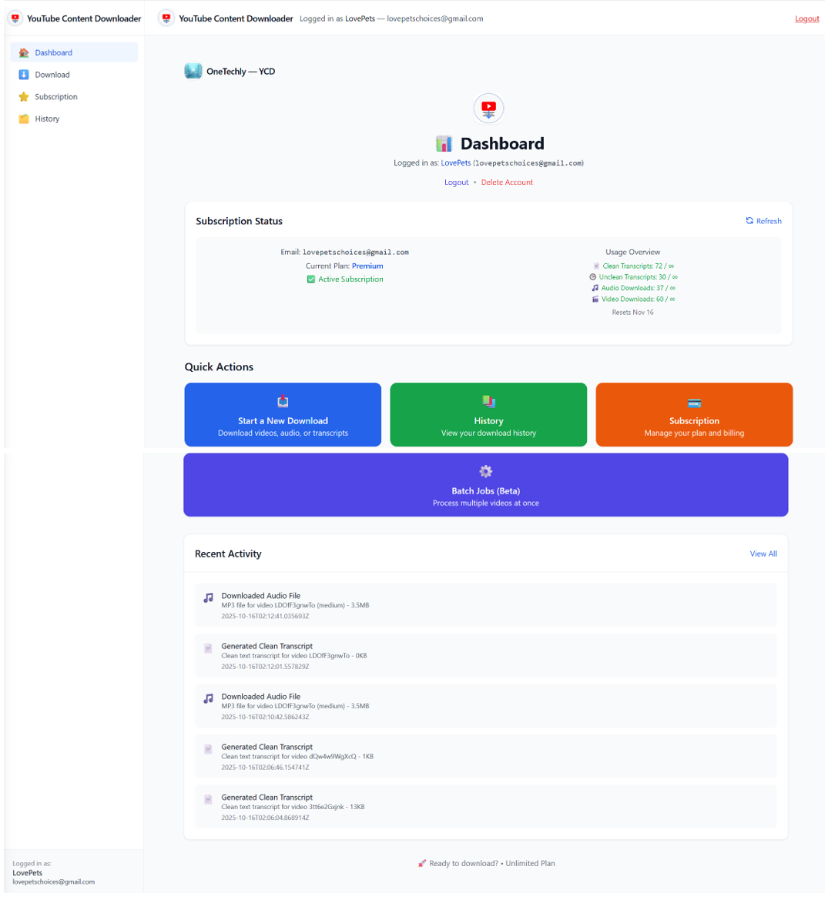

# 🎬 YouTube Content Downloader (YCD) — by OneTechly


**OneTechly** builds cloud-native SaaS solutions that simplify how creators, developers, and businesses manage content.  
**YouTube Content Downloader (YCD)** is a sleek, mobile-ready application that lets users extract clean YouTube transcripts, MP3 audio, or full video downloads — all within a secure, scalable, and subscription-enabled platform.

🌐 **Live App:** [https://onetechly.com/ycd](https://onetechly.com/ycd)  
🏢 **Company:** [https://onetechly.com](https://onetechly.com)

---

## 🚀 Overview

YCD provides a full-stack SaaS experience:

- **Frontend:** React + Tailwind (modern, responsive UI)
- **Backend:** FastAPI (Python) with SQLAlchemy ORM
- **Payments:** Stripe integration with webhooks
- **Deployment:** Render cloud platform
- **Database:** SQLite / PostgreSQL (production-ready)
- **Security:** JWT authentication, HTTPS, and CORS guardrails

It’s designed for simplicity, elegance, and reliability — with the same polish and professionalism you expect from a production-grade SaaS.

---

## ✨ Features

| Category | Description |
|-----------|-------------|
| 🧠 **Transcripts** | Clean and timestamped YouTube transcripts in multiple formats |
| 🎧 **Audio** | Convert videos to MP3 audio seamlessly |
| 🎥 **Video** | Download full YouTube videos |
| 🧾 **Subscriptions** | Stripe-powered Pro & Premium plans |
| 🔒 **Authentication** | Secure JWT-based login system |
| 📱 **Mobile-Ready** | Fully responsive and optimized for all screen sizes |
| 📊 **Dashboard** | Real-time usage tracking, batch jobs, and history logs |
| ☁️ **Scalable** | Cloud-native deployment, automatically managed by Render |

---

## 🖼️ Screenshots

### 🌐 OneTechly Homepage  
*Professional SaaS landing with modern UI components.*


---

### 🎯 Product Landing — YouTube Content Downloader  
*Clean, branded entry page for users to sign in or create an account.*



---

### 📊 Dashboard Page  
*Modern user dashboard with subscription insights and activity logs.*



---

## ⚙️ Installation

Clone the repository and install dependencies:

```bash
git clone https://github.com/Ambro19/onetechly-frontend.git
cd onetechly-frontend
npm install


<!-- # Onetechly Frontend

Company marketing site + YouTube Content Downloader (YCD) app shell.

- **Framework:** React (CRA)
- **Hosting:** Render (Static Site)
- **Domain/DNS:** Cloudflare — `onetechly.com`
- **API:** FastAPI on Render at `https://api.onetechly.com`

## Quick start

```bash
# install
npm ci

# run dev
npm start

# build production bundle
npm run build

# preview the built bundle locally (optional)
npx serve -s build -->
